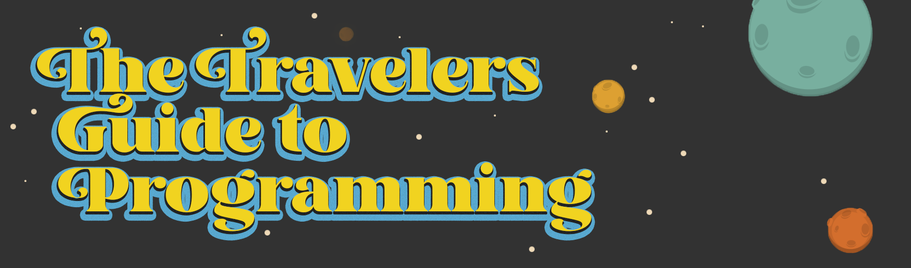

# Travelers Guide to Programming

The Travelers Guide to Programming is an open-sourced project intended to help provide all the necessary 
information and resources required for anyone looking to dive into the field of Computer Science / 
Programming without having to break the bank or be stuck behind a paywall or subscription.
**No paywall, no subscriptions, no excuses. This shits free!**

The overall scope is to have everything completely included with no necessary requirements from external 
sources unless completely necessary.

## Subjects

For topics that are currently work in progress, take a look at [What is coming?](#what-is-coming)

- Programming Languages
  - [Python](subjects/python/README.md) - _LAST PHASE_

## What is coming?

In time, there will be milestones added to allow for tracking the upcoming details on the 
following and future subjects.

- General
  - [Introduction to Computer Science](subjects/introduction-to-computer-science/README.md)

- Mathematics
  - [Pre Algebra](subjects/pre-algebra/README.md)
  - [Algebra I](subjects/algebra-i/README.md)
  - [Algebra II](subjects/algebra-ii/README.md)
  - [Pre Calculus](subjects/pre-calculus/README.md)
  - [Calculus I](subjects/calculus-i/README.md)
  - [Calculus II](subjects/calculus-ii/README.md)

- Programming Languages
  - [HTML](subjects/html/README.md)
  - [CSS](subjects/css/README.md)
  - [Javascript](subjects/javascript/README.md)
  - [Bash](subjects/bash/README.md)

## Looking to Contribute?

Thinking of contributing to the Travelers Guide to Programming? That's great! We'd love to have you. Take a quick detour to [CONTRIBUTING.md](CONTRIBUTING.md) on where and how you can get involed with the community.

## Contributions

If you're looking to make contributions, for steps and resources follow the [DEVELOPMENT](DEVELOPMENT.md) guide for an overall rundown.

## License

[MIT](LICENSE.md)