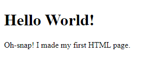

# 1. Introduction to HTML

## 1 Summary

HTML stands for Hyper-Text Markup Language, it is a markup language initially created by Tim Berners-Lee. A website can be built using plain HTML. This tutorial explains you how. At the end of this tutorial you will have a responsive Fab Academy documentation website made with pure HTML that looks good on all devices.

## 2 Understanding HTML

HTML stands for HyperText Markup Language. It is a standard markup language for web page creation. It allows the creation and structure of sections, paragraphs, and links using HTML elements (the building blocks of a web page) such as tags and attributes.

It is the standard markup language for creating webpages, it describes the structure of a Web page, and consists of a series of elements. The elements tell the browser how to display the content to the user.

## 3 Getting Started

An HTML document is a plain text file, usually with an extension `.html` or `.htm`, and to write one you don't have to download anything as you can edit them using Windows - **Notepad** or Mac - **TextEdit**.

Though it is recommended to use one of the following editors as they allow for syntax colorization -

- [Sublime](https://www.sublimetext.com/)
- [Atom](https://atom.io/)
- [Notepad++](https://notepad-plus-plus.org/) (_Windows Only_)


## 4 Creating your first document

1. Create a folder somewhere where you can easily remember like `my_awesome_html_pages`.
2. In that directory, create a file with a fancy name like `my_awesome_file.html`, but the default go to would be to name it `index.html`.
   - For the sake of the example, ours will be named `index.html`.
3. If not already, you should be able to open your new file in your prefered text editor.

Now you should have a file structure that goes as follows -

```
my_awesome_html_pages/
└── index.html
```

The reason I'm going to call our file **index.html** because when opening a webpage in your browser, **index.html** is usually the default file it points to for most websites.

Last but not least, paste the following text into the **index.html** file and save it -

```html
<h1>Hello World!</h1>
<p>Oh-snap! I made my first HTML page.</p>
```

Finally, you can open your **index.html** with your prefered browser like Chrome or Firefox.
1. Right-click **index.html**.
2. Click **Open with...**.
3. Scroll down to your choice of browser and click **Open**.
4. You should see the following -



**Congrats!** You've just created your first webpage.

## 5. Understanding Basic Tags

HTML is written using **tags**. Most of the tags have an opening tag (such as `<h1>`) and a corresponding closing tag (such as `</h1>`). In-between the opening and closing tag there is content. The browser reads the tags and based on them decides how content should be displayed.

`<h1>` tag stands for **Heading 1**. It describes the topmost level of headings. If you think of a HTML document as a book, chapters usually have sections and sub-sections. Every consequent sub-section has a heading with an increased number.

```html
<h1>Chapter 1</h1>
<h2>Section 1.1</h2>
<h3>Sub-Section 1.1.1</h3>
...
<h6>Least Important Heading</h6>
```

The `<p>` tag stands for **Paragraph** of text. A section in a book usually consists of paragraphs of text, images and tables. Usually there are more than one paragraph of text.

```html
<h1>Introduction</h1>

<p>This section is here to give an introduction of the current state of mind.</p>

<p>The current state of mind is about to declare that all tags are equal, however there are facts that prove that being wrong.</p>

<p>The comitee has decided to postpone the decision about his matter as there is nothing to decide.</p>
```

The content between the opening `<p>` and closing `</p>` tags can be emphasized by using one of the supporting tags `<b>` that stands for **bold**, `<i>` that stands for italics or `<u>` that stands for **underline**. When you use them within a HTML paragraph, they can be called **nested tags**.

```html
<p>This text is about <b>bold</b>, <i>italicized</i> and <u>underlined</u> parts of a story.</p>
```

Below is an image where you can see how it should look like. Feel free to use your text editor to try it out yourself.


## 6. Attributes and Image Tag

There are HTML tags that require a few **attributes** to be set. One of such tags is the `` or **image** tag. In a real-life scenario it would look as follows.

```html

```

It is also one of the HTML tags that do not require a closing tag. Try to copy any `.jpg` image to the same directory where your `index.html` file so that the file structure of your project looks as the following.

```
html
├── image.jpg
└── index.html
```

Let's put the `` tag into context. 

```html
<h1>Hello!</h1>

<p>This text is about <b>bold</b>, <i>italicized</i> and <u>underlined</u> parts of a story.</p>


<p>Photo by The Hadfields – CC</p>
```

After saving `index.html`, it should look similar to the screenshot below. You should see the image that you used.


You can specify the size of the image by using the **width** and **height** attributes of the `` tag. The follwing will make your image **responsive** or in simple terms it will automatically adjust to the width of your browser window.

```html

```

## 7. Using Lists

Lists are an important part of any scientific drama. How to make separate conceptual elements not blur with the surrounding text? Use lists! 

Most used types of lists are the **ordered list** (`<ol>`) and **unordered list** (`<ul>`). Each list contains a *list* of elements (`<li>`). In real HTML scenario it looks as in the following example.

```html
<ol>
    <li>Element one</li>
    <li>Element two</li>
    <li>Element three</li>
</ol>

<ul>
    <li>First</li>
    <li>Second</li>
    <li>Third</li>
</ul>
```

In the case of ordered list, you do not have to add numbers. According to the HTML specification, browser has to do that automatically depending on the order of elements. The HTML code above should look similar as in the image below, when opened in a web browser.


In the code example above you can also see an example of nesting. Usually nested elements are preceded with either **4 space** characters or a **TAB**.


## 8. Exploring Tables

HTML `<table>` element was ruling the web design universe during the 1990s. Before CSS came along, `<table>` element was the ultimate tool for creating complex website layouts. The `<table>` element is not enough to create a real table with rows and columns. `<tr>` is used to define **rows** and `<td>` are defining the **columns**. 

Below you can see code that defines a simple HTML table.

```html
<table>
    <tr>
        <td>This column 1</td>
        <td>This column 2</td>
    </tr>
    <tr>
        <td>This is column 1 in row 2</td>
        <td>This is column 2 in row 2</td>
    </tr>
</table>
```

In the browser it should look like in the image below.


You can also add **borders** and make it **responsive** by adding `border` and `witdh` attributes like so.

```html
<table border="1" width="100%">
    <tr>
        <td>This column 1</td>
        <td>This column 2</td>
    </tr>
    <tr>
        <td>This is column 1 in row 2</td>
        <td>This is column 2 in row 2</td>
    </tr>
</table>
```

It should look as in the image below.


You can also use tables to show multiple images next to each other. Often it is the case when you do Fab Academy documentation. Example below. I am using the same image as in the example above.

```html
<table width="100%">
    <tr>
        <td>
            
        </td>
        <td>
            
        </td>
    </tr>
</table>
```

And below is how it looks like. In order to have a perfect 50/50 alignment, both of the images should be the same size in pixels.


Some people will want to remove the gap between the images. It is caused by two attributes of the `<table>` element, `cellspacing` and `cellpadding`. Adjust the `<html>` part of the code above to match the example below and there should be no gap no more.

```html
<table width="100%" cellspacing="0" cellpadding="0">
```


## 9. Adding Document Structure

In a real-life scenario we will need a few more HTML tags to get the job done. There are tags that define the structure of a HTML document. It starts out with the **DOCTYPE** or document type. Obviously, it is HTML.

```html
<!DOCTYPE html>
```

It is not enough to tell the browser that it is going to be a HTML document by having a DOCTYPE. We need to use the `<html>` document tag also. 

```html
<!DOCTYPE html>
<html></html>
```

As you can see the `<html>` tag has a closing tag `</html>`. Between these tags there comes the invisible part of the website `<head>` and visible `<body>`.

```html
<!DOCTYPE html>
<html>
    <head></head>
    <body></body>
</html>
```

In the `<head>` part we can define important information about our document, such as the `<title>` and other `<meta>` information. Below I am adding a title of the document and some important meta-information for my browser to display it in the way I want. 

```html
<!DOCTYPE html>
<html>
    <head>
        <title>Kris Does Fab Academy</title>
        <meta charset="utf-8">
        <meta name="viewport" content="width=device-width">
    </head>
    <body></body>
</html>
```

The `<meta charset="utf-8">` tells the browser to take into account exotic characters, such as ā, ä or ß. The `<meta name="viewport" content="width=device-width">` tells the browser to limit the width of the page to the width of the screen of the device (computer, tablet or phone display).

Finally in the `<body>` part we can add our visible content. Let it be our **About** page.


```html
<!DOCTYPE html>
<html>
    <head>
        <title>Kris Does Fab Academy</title>
        <meta charset="utf-8">
        <meta name="viewport" content="width=device-width">
    </head>
    <body>
        <h1>Kris Does Fab Academy</h1>
        <p>Welcome to my Fab Academy documentation website!</p>

        <h2>About</h2>
        <p>My name is Kris. I am the author of this tutorial. Below you can see images of me (left) and my cat (right).</p>

        <table width="100%" cellspacing="0" cellpadding="0">
            <tr>
                <td>
                    
                </td>
                <td>
                    
                </td>
            </tr>
        </table>

        <p>&copy; Krisjanis Rijnieks 2019</p>
    </body>
</html>
```

Replace text as you like to match your personality, but at the end of it in the browser it should look similar as in the image below.


## 9. Adding Final Project Page

Assuming that you have created your final project sketch, we can now create a HTML page for it. What you have to do is to copy the `index.html` file and rename the result to `final-project.html`.

> **Remember:** HTML and the web in general does not like file names with spaces. Capitals are not welcome in most cases also.

The directory structure of our project should look similar to the one below (I excluded the image files here).

```
html
├── index.html
└── final-project.html
```

By copying it you will make sure that it has the exact structure as the **About** page. Change it to describe your final project, similar to the way it is done below.

```html
<!DOCTYPE html>
<html>
    <head>
        <title>Final Project</title>
        <meta charset="utf-8">
        <meta name="viewport" content="width=device-width">
    </head>
    <body>
        <h1>Final Project</h1>
        
        <p>This is my final project page. Below you can see the sketch I made after meditating for three days.</p>

        
    </body>
</html>
```

The code above in the browser.


## 10. Hyperlinks and the Menu

HTML is **Hyper-**Text Markup Language, not just Text Markup Language. Its power hides into the ability to form **hyperlinks** between HTML documents. 

Sections of a website are usually connected via hyperlinks. It is usually done by using a menu that is visible on all the pages. Links in HTML are described with the `<a>` tag which has a closing part `</a>`.

```html
<a href="final-project.html">Final Project</a>
```

Above you can see a link that will take us to the final project page. If we put it in the `index.html` page, it looks as follows.

```html
<!DOCTYPE html>
<html>
    <head>
        <title>Kris Does Fab Academy</title>
        <meta charset="utf-8">
        <meta name="viewport" content="width=device-width">
    </head>
    <body>
        <a href="final-project.html">Final Project</a>

        <h1>About</h1>
        <p>My name is Kris. I am the author of this tutorial. Below you can see images of me (left) and my cat (right).</p>

        <table width="100%" cellspacing="0" cellpadding="0">
            <tr>
                <td>
                    
                </td>
                <td>
                    
                </td>
            </tr>
        </table>
    </body>
</html>
```

You should see a link to the final project page in the browser.


What you will notice after you click on the link is that there is no way to go back! In order to fix that, we are going to improve the existing menu in `index.html` file and copy it over to the `final-project.html`.

```html
<ul>
    <li>
        <a href="index.html">About</a>
    </li>
    <li>
        <a href="final-project.html">Final Project</a>
    </li>
</ul>
```

It is your challenge to figure out how and where to place it in both pages so the outcome looks like in the images below.

| | |
| --- | --- |
|  |  |


## 11. Problems Faced and Solutions

- Problem: Images do not show up
  - **Solution**: Make sure that your images are in the same directory with the `.html` files.

- Problem: The page layout is broken. Especially after I added the `<table>`.
  - **Solution**: Check if for each opening tag (such as `<td>`) there is a closing tag (such as `</td>`). Use an [online HTML validator](https://validator.w3.org/) if in trouble.

## 12. Links for other sources / useful information
  - [HTML 5.2 Recommendation](https://www.w3.org/TR/html52/)
  - [MDN HTML Reference](https://developer.mozilla.org/en-US/docs/Web/HTML/Element)


